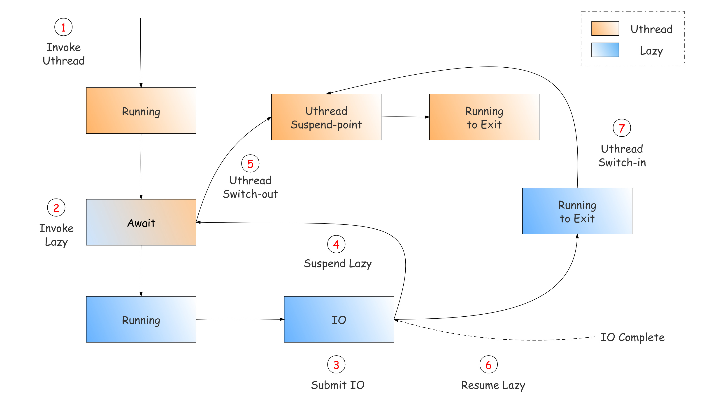

## HybridCoro

Stackful coroutine and stackless coroutine are used broadly now. But we found that they have their own advantage and disadvantage in pratice. The overhead of stackless coroutine comes from dynamic memory allocation, exception handling and parameter copying. Although the compiler would try to optimize them, the overhead would remain after all. When the call chain is relatively deeper, the performance of coroutine would be worse compared to normal function. Another drawback of stackless coroutine is polluting, if you uses stackless coroutine, the caller need to be stackless coroutine too. For stackful coroutine, it didn't have the drawbacks of stackless coroutine. But it has its own problems.

#### Stackless Coroutine (Lazy)

- Be able to write asynchronous code in synchronous way.
- Extremely fast for switching. It doesn't need to save and resume the context.
- It would be best when the concurrency is very high. The mechanism support a great many stackless coroutine cooperates with each other.
- It is intrusive.
- The performance is relative with the depth of call-chain.

#### Stackful Coroutine (Uthread)

- Be able to write asynchronous code in synchronous way.
- Not intrusive except asynchronous IO.
- Worse performance than stackless coroutine when the concurrency is very high.
- The performance isn't relative with the depth of call-chain.

### Example

There is a feature in our production codes. The user's request would be passed by a very deep call chain to the modules where a mount of asynchronous IOs happen actually. So in practice we would try to put the code of user's request into stackful coroutine, and we use stackless coroutine in the codes which need to do a great many queries concurrently. In this way, we could reduce the overhead as much as possible.

### Summarize

Stackless coroutine is better in case we need to handle very high concurrency. But due to many reasons (Intrusiveness, compiler switching in other business), it is not easy to use stackless coroutine throught all of our production code. Considering that the stackful coroutine could mitigate these problems, we designed hybrid coroutine in practice. Hybrid coroutine allows a query runs in both stackful coroutine and stackless coroutine so that the codes could get the benefit from both.
